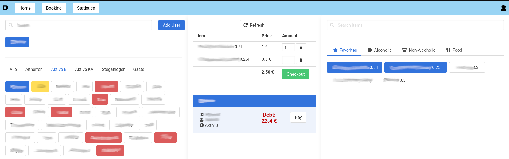
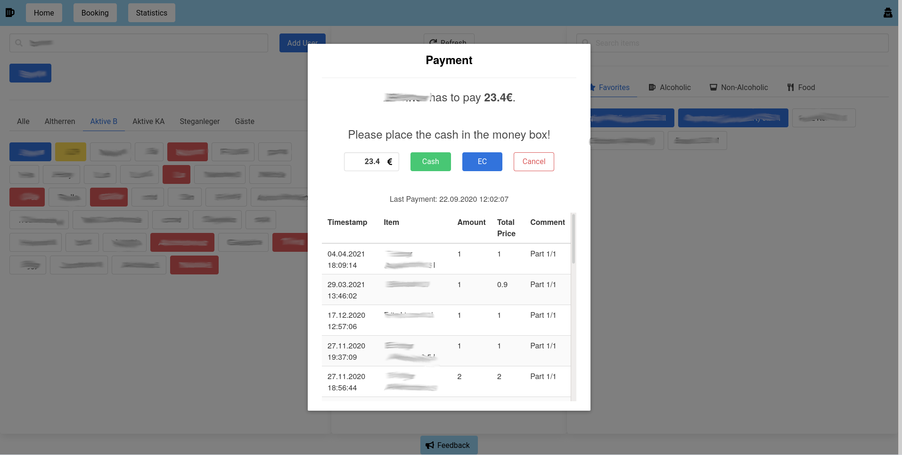
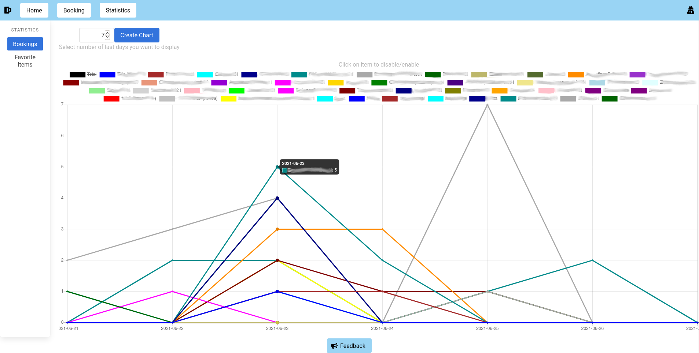
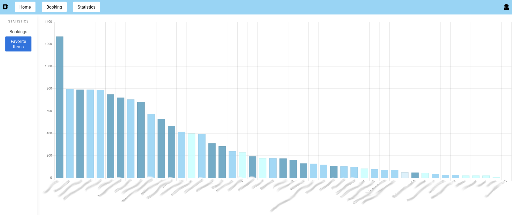
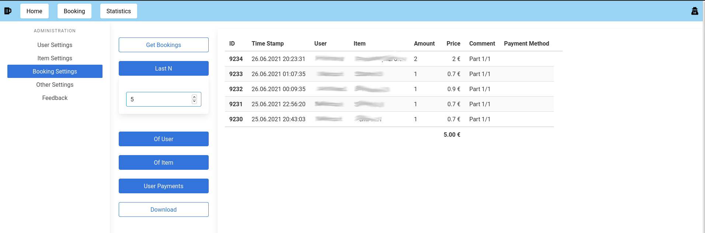
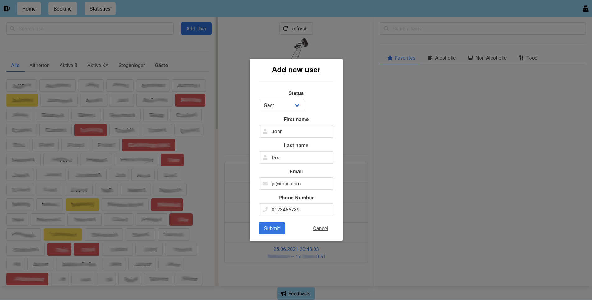

# AVH Booking System

Booking system based on liabilities for clubs and societies.  

Docker image: [maseiler/avhbs](https://hub.docker.com/repository/docker/maseiler/avhbs)

> [!NOTE]
> This branch is the latest release. Please note that we are currently developing a new version on branch [v3/main](https://github.com/av-huette/avh-booking-system/tree/v3/main).

## Examples
### Book new items

### Pay debts

### Statistics

### Admin panel

### Add new user

